# The Optimum Medical Student: A Comprehensive Analysis of the Biometric Data of Medical Students in the University of X in 2020 ⚕👨‍⚕️
*Data used in this analysis is entirely fictional*

Table of Contents
---

1. Project Overview
2. Data
3. Project Goal
4. Exploratory Data Analysis
5. Conclusion

Project Overview🙂
---
In this project, I explored a medical school - University of X to analyze the health statistics of medical students and identify opportunities to improve the health statistics amongst this sect. I analyze the data using Ms-Excel's pivot table and used detailed visualizations to paint the current health status of medical students in the campus and draw insights on boosting health parameters.

Data🗃️
---
The data set contains the Student ID, Age, Gender, Height, Weight, BMI, Temperature, Heart rate, Blood pressure, Blood group, Cholesterol levels, Smoker/non-smoker, Diabetic vs not diabetic.

Project Goal
---
My main aim is to identify areas where recommendations can be made to improve the health status of these students.

Exploratory Data Analysis
---

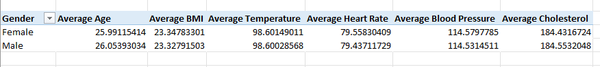

The table above shows the average age , body mass index (BMI), temperature  (in F), heart rate,blood pressure and blood cholesterol of males and females in the campus. The result shows that these parameters are almost equal in both gender and they fall within the normal range of optimal health. The average of these data was gotten using the average function in Microsoft Excel.

---

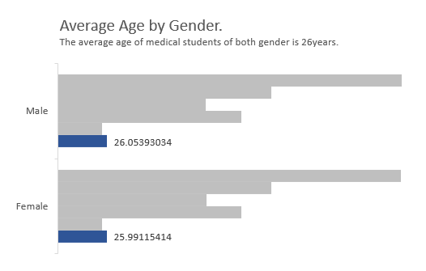

This chart shows that the average age of medical students in the University of X is 26 years for both males and females.

---

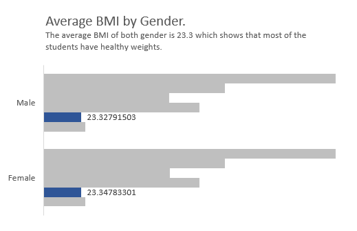

This reveals that the average BMI of both gender is almost equal at 23. This falls within the range of normal and signifies that the average student has appropriate weight for height.

---

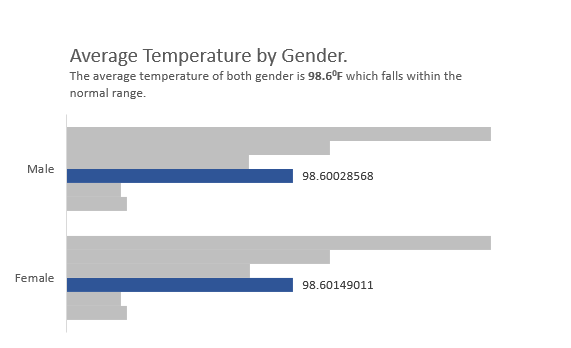

The average temperature for both sex is 98.6 degrees Fahrenheit, which is normal.

---

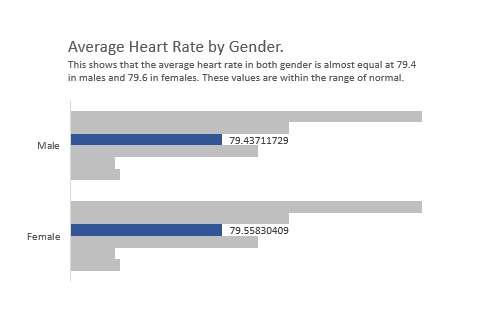

The average heart rate is almost same at 79.4 and 79.6 in males and females respectively.

---

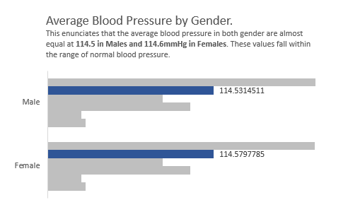

The average blood pressure is 114.5 and 114.6 in males and females accordingly.

---

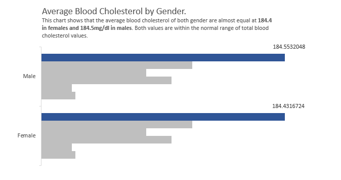

The average blood cholesterol is 184.4 and 184.5mg/dl in females and males.

---

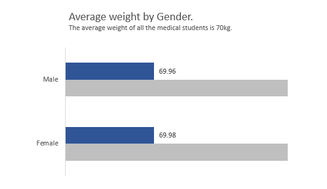

The average weight for both gender is approximately 70kg.

---

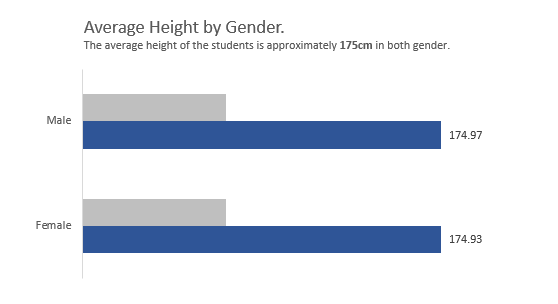

The average age for both sexes is 175cm.

---

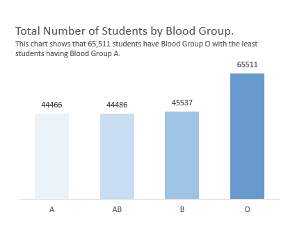

About 1/3rd of the students possess blood type O, with the remaining blood types being evenly distributed amongst the other students. This is significant as the O blood type is rare. It is also a universal donor in the health setting hence, these students can be encouraged to donate blood periodically.

---

Most of the students are non-smokers, however about one-fifth of them are smokers. This is significant as this could impact on the overall health of the student population. Measures could be put in place to dissuade these students from engaging in smoking. This could include prohibiting smoking on the campus grounds and introducing these students to therapy.

---

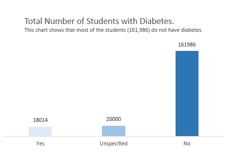

Less than 10% of the total students are diabetic. Steps could be taken to improve the quality of life of these students. This includes providing free medication and health insurance, regular health checks amongst others.

---

Conclusion
---
In conclusion, the average medical student in the University of X in 2020 can be pronounced healthy.
